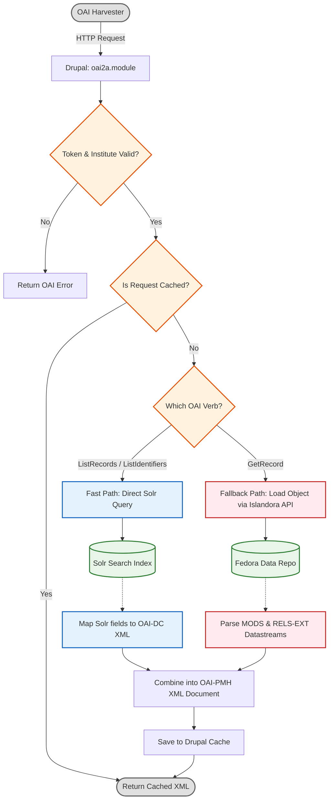

# OAI2A System Architecture

This higher-level diagram simplifies how the newly optimized `oai2a` endpoint interacts with Drupal, Solr, and Fedora to serve metadata efficiently.

## Core Flow (Fast vs. Fallback)

The core optimization relies on short-circuiting expensive Fedora API calls whenever possible, serving batches of metadata directly from Solr search indexes ("The Fast Path").

## Why is it faster?
In the legacy (`oai2`) architecture, fetching 1,000 records required **1,000 separate calls to Fedora**. 
In the modern (`oai2a`) architecture, fetching 1,000 records requires just **1 call to Solr**, mapping the response payload instantly in memory.
